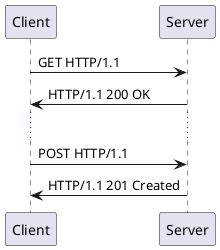

TCP
===

#### Sequence Diagram



#### Sequence Diagram

```plantuml

```

References
----------

[Wikipedia - Hypertext Transfer Protocol](https://en.wikipedia.org/wiki/Hypertext_Transfer_Protocol)
