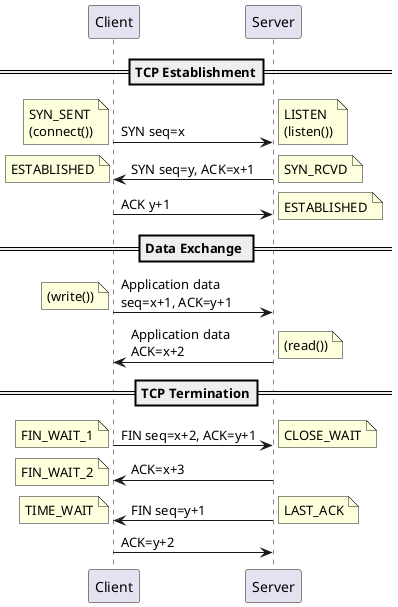

TCP
===

```plantuml
@startuml
participant "Client" as c
participant "Server" as s

== TCP Establishment==
c->s: SYN seq=x
note left: SYN_SENT\n(connect())
note right: LISTEN\n(listen())
s->c: SYN seq=y, ACK=x+1
note right: SYN_RCVD
note left: ESTABLISHED
c->s: ACK y+1
note right: ESTABLISHED
== Data Exchange ==
c->s: Application data\nseq=x+1, ACK=y+1
note left: (write())
s->c: Application data\nACK=x+2
note right: (read())
==TCP Termination==
c->s: FIN seq=x+2, ACK=y+1
note left: FIN_WAIT_1
note right: CLOSE_WAIT
s->c: ACK=x+3
note left: FIN_WAIT_2
s->c: FIN seq=y+1
note right: LAST_ACK
note left: TIME_WAIT
c->s: ACK=y+2

@enduml
```
